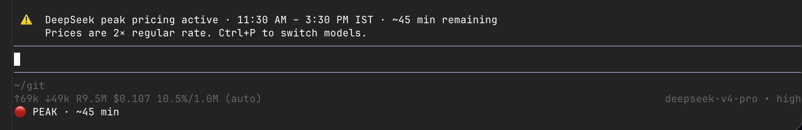
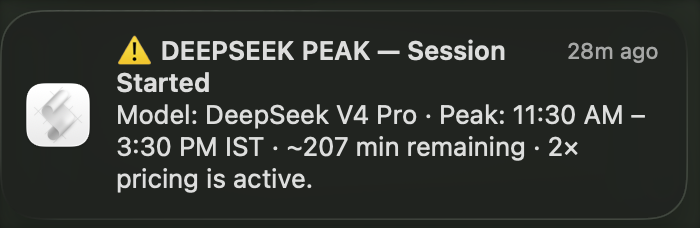
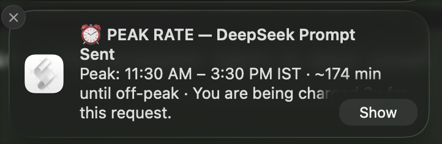
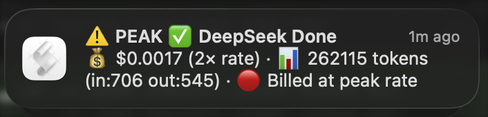

# pi-deepseek-peak-alert

[](https://www.npmjs.com/package/pi-deepseek-peak-alert)
[](LICENSE)

- 📦 [npm](https://www.npmjs.com/package/pi-deepseek-peak-alert) · [pi.dev](https://pi.dev/packages?name=pi-deepseek-peak-alert) · [GitHub](https://github.com/napender/pi-deepseek-peak-alert)

A [pi](https://pi.dev) extension that sends desktop notifications when you're using DeepSeek models during **peak pricing hours** (2× regular rates).

DeepSeek introduced peak/valley pricing in July 2025. This extension makes sure you never accidentally burn double credits without knowing.

## Screenshots

**In-app TUI warnings** (status bar + widget banner):



**Desktop notifications:**

<table>
  <tr>
    <td align="center"><b>Peak session warning</b></td>
    <td align="center"><b>Prompt rate alert</b></td>
    <td align="center"><b>Agent completion</b></td>
  </tr>
  <tr>
    <td></td>
    <td></td>
    <td></td>
  </tr>
</table>

## Peak Hours (DeepSeek)

DeepSeek peak hours are fixed in **UTC**:

| Slot | UTC |
|---|---|
| Morning peak | 01:00 – 04:00 |
| Afternoon peak | 06:00 – 10:00 |

During these windows, all API billing items are **doubled**. The extension converts these to your local timezone automatically (see below).

### What's your local peak time?

The default timezone is **IST (UTC+5:30)**. To see peak hours in your timezone, change `TIMEZONE_OFFSET_HOURS` in the extension file. Common offsets:

| Timezone | UTC Offset | `TIMEZONE_OFFSET_HOURS` | Peak (approx) |
|---|---|---|---|
| IST (India) | +5:30 | `5.5` | 6:30–9:30 AM & 11:30 AM–3:30 PM |
| EST (US Eastern) | -5 | `-5` | 8:00–11:00 PM & 1:00–5:00 AM |
| PST (US Pacific) | -8 | `-8` | 5:00–8:00 PM & 10:00 PM–2:00 AM |
| GMT (UK) | 0 | `0` | 1:00–4:00 AM & 6:00–10:00 AM |
| CET (Central Europe) | +1 | `1` | 2:00–5:00 AM & 7:00–11:00 AM |
| CST (China) | +8 | `8` | 9:00 AM–12:00 PM & 2:00–6:00 PM |
| JST (Japan) | +9 | `9` | 10:00 AM–1:00 PM & 3:00–7:00 PM |
| AEST (Sydney) | +10 | `10` | 11:00 AM–2:00 PM & 4:00–8:00 PM |

## What It Does

| Trigger | Notification |
|---|---|
| Switch to DeepSeek during peak | ⚠️ "DEEPSEEK PEAK HOURS — 2× PRICE" |
| Peak hours begin while DeepSeek is active | ⚠️ "DEEPSEEK PEAK HOURS STARTED" (background timer) |
| Every prompt sent during peak | ⏰ "PEAK RATE — Prompt Sent" |
| Agent run completes | Shows cost with "(2× rate)" label if peak |
| DeepSeek errors | ❌ Error notification |

Plus a `/deepseek-peak` command to check status anytime.

## Install

### Via pi (recommended)

```bash
# From npm (once published)
pi install npm:pi-deepseek-peak-alert

# From git
pi install git:github.com/napender/pi-deepseek-peak-alert

# Local
pi install /path/to/pi-deepseek-peak-alert
```

### Manual

Copy `extensions/deepseek-notify.ts` into `~/.pi/agent/extensions/`.

## Usage

The extension loads automatically. No flags, no config.

```bash
pi
/model          # pick a DeepSeek model
/deepseek-peak  # check peak status anytime
```

If you're in peak hours, you'll get a desktop notification immediately upon switching.

## Platform Support

| OS | Mechanism |
|---|---|
| macOS | `osascript` display notification (built-in) |
| Linux | `notify-send` (requires `libnotify-bin`) |
| Windows | PowerShell toast notifications |

## Configure Your Timezone

Open `extensions/deepseek-notify.ts` and change **one line** near the top:

```typescript
// Change this to your UTC offset (e.g. -5 for EST, +1 for CET, +8 for CST)
const TIMEZONE_OFFSET_HOURS = 5.5; // IST (UTC+5:30)
```

All notifications and the `/deepseek-peak` command will then display times in your local timezone. Reload with `/reload` after editing.

### Other Customizations

Same file, same `/reload` reload:

- **Disable specific notifications** — comment out the `pi.on(...)` blocks you don't want
- **Change notification sound** — macOS: `sound name "Glass"`, Linux: `-u critical`
- **Cost threshold** — wrap `agent_end` notify in `if (totalCost > 0.05)`
- **Custom timezone labels** — change `tzAbbr()` return values

## Edge Cases Covered

- ✅ Switch to DeepSeek mid-session during peak
- ✅ Session starts with DeepSeek default in peak
- ✅ Idle session — peak starts while you're away (timer catches it)
- ✅ Actively working — peak starts mid-run (timer notifies; billing label uses request-start time)
- ✅ Peak ends mid-run (correctly shows peak billing)
- ✅ Timer only fires when DeepSeek is active (silent on other models)

## Uninstall

```bash
pi remove pi-deepseek-peak-alert
```

## License

MIT
